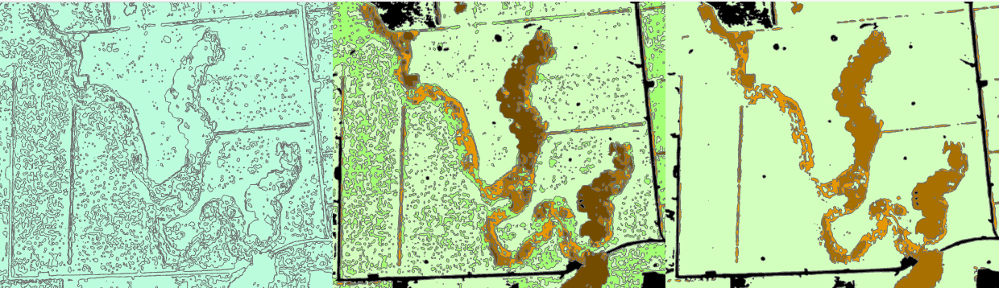

# Riparian Planting Segmentation model
This repository contains code to train and run a convolutional neural network model for segmenting 4-band Maxar imagery into classes relevent to monitoring Riparian planting.  
The code and model contained here were developed by Lynker Analytics Ltd and Pattle Dalamore Partners Ltd (PDP) for the Ministry for the Environment, Manatū Mō Te Taiao.

## Contents
1.  [Environment](#environment)  
2.  [Model Classes](#model-output-classes)  
3.  [Running Inference](#model-inference)  
4.  [Visualising Classified Raster](#visualising-classified-raster-outputs)  
5.  [Input Raster Imagery](#maxar-input-rasters)  
6.  [Model Training](#model-training)  
7.  [Acknowledgements](#acknowledgements)  

### Overview
The code herein supports training and inference for a semantic segmentation convolutional neural network model for landcover classification with classes relevant to monitoring riparian planting.    

The model architecture is DeepLabV3+, using pre-trained weights, with slight modification to accept RGBI input.    
The model has been trained on pansharpened 4-band Maxar imagery resampled to 0.32m per pixel.

Folder structure:
```
	./
	./models/		Binary model weights files
	./logs/		Log files from model training
	./data/		Image and label data for model training
	./data/train/		Training data
	./data/valid/		Validation (monitoring) data
	./indata/		default location for input rasters (Maxar 4-band)
	./output/		default location for output classified rasters
```

### Example inference:


## Environment
* This code has been tested on python 3.7.5 and 3.10.6
* using tensorflow 2.9.0 and 2.11.0
* see the requirements.txt file for the library versions used to test on the python 3.10.6 system
* other system/environment details of the test system ("system 1")
	* ubuntu 22.04
	* RTX 4090 nvidia GPU
	* 64GB memory
	* cuda 11.8
	* cudnn 8.6
	* python 3.10.6
	* tensorflow 2.11.0
	* Also tested
		* ("system 2") ubuntu 20.04, RTX 3080 GPU, 32GB memory, cuda 11.6 and cudnn 8.4, python 3.7.5, tensorflow 2.9.0
	* Any GPU/cuda/cudnn combination supported by tensorflow 2.9+ will probably work but haven't been tested by us.
	* The code and model from this repository will probably work without a GPU but will be slow

## Model output classes
The model outputs 6 classes, although the model is configured to output 7 channels to allow for a no-data channel. The gridcodes used in the GIS to represent these classes are the same but with 100 added.  The following table shows these classes:

| CNN Class   | GIS gridcode  | Description       |
|-------------|---------------|-------------------|
| 0           | 100           | No Data           |
| 1           | 101           | Tall Woody        |
| 2           | 102           | Medium Woody      |
| 3           | 103           | Small Veg         |
| 4           | 104           | Rank Grass        |
| 5           | 105           | Pasture Grass     |
| 6           | 106           | Unvegetated       |

* See the symbology_6class.lyrx for polygon symbology


## Model inference
Model inference expects there to be a trained model file in the models/DeepLab/ directory. For example:
* models/DeepLab/riparian_lkr_pdp_1.h5
* cksum models/DeepLab/riparian_lkr_pdp_1.h5
	* 2912329551 47748848 models/DeepLab/riparian_lkr_pdp_1.h5

* The inference.py script runs inference on input 4-band Maxar rasters. By default, this looks for input rasters in the "./indata" folder.  Rasters can be either .jp2 or .tif.
* by default, classified rasters will be written to the ./output folder.
* Two rasters are written:
	* <input_file_name>_class.tif - this is a single channel classified raster with integer output
	* <input_file_name>.tif - this is a 7 channel float32 raster.
		* The channels correspond to the model classes
		* Each channel 0-6 will have a probability value for the given channel per pixel.
		* The sum over all channels per pixel will be 1.
		* The index of the highest valued channel per pixel in the probability raster should match the integer value at that pixel in the corresponding *_class.tif raster
	* the *_class.tif raster will be smallest and easiest to work with. You can load this into a desktop GIS appplication for viewing. 
	* the probability raster allows you to see probability by class, allowing more detailed analysis and reweighting of classes.

### How to run inference:
With defaults:
```
	python inference.py
```
With specified input directory, output directory locations, and model file:
```
	python inference.py --indir indata --outdir output --modelfile models/DeepLab/riparian_lkr_pdp_1.h5
```

## Visualising classified raster outputs
* In this section, we'll look at an example output of the model, as produced by the inference script.
* This example uses the ArcGIS desktop software to visualise the output but a similar process in other GIS software such as QGIS will be possible but is not explored here.
* We used ArcGIS Pro version 3.0.2 and menu paths, tools and behaviours mentioned in this section are specific to this application and version.
1. Navigate to the __outdir__ specified in the inference command. By default, this will be the __output__ subdirectory.
1. you should see (at least) two .tif files here. One matching this file pattern:  *_class.tif is the classified raster.
1. copy the *_class.tif file to a location accessible to your ArcGIS software.
1. create or open a project with a visible map
1. drag and drop (or use the "add data" tool) the *_class.tif raster to your map

        

1. Create a polygon layer from the raster using the "Raster to Polygon" tool found under the "Analytics -> Tools" menu. Note, we unchecked the "simplify polygon" checkbox.

        

1. Apply the symbology layer supplied in this repository "symbology_6class.lyrx", using the "Apply Symbology From Layer" tool from the Analytics->Tools menu.

        

1. The result will be a 6-class visualisation.
1. Reducing this to 4-classes is possible by editing the attribute table.  This process is not detailed here, but in brief: Update gridcode 101 to 102. Update gridcode 104 to 105. The visual appearance can then be improved by dissolving boundaries between neighbouring polygons with the same class (gridcode). This isn't detailed here but you can achieve this using a "Dissolve" tool from the Analytics->Tools menu.

        

## Maxar input Rasters
* The trained model included in this repository was trained on Maxar 4-band imagery over a site in the Taranaki region.
* The input imagery to the deep learning model is 4-band Maxar. Maxar has a native ground sample distance varying between 0.3m and 0.5m in the panchromatic channel but lower resolution in the multi-spectral bands. The Taranaki all-sites region and the additional sites are pansharpened and resampled to a standard ground sample distance of 0.32m
* Pan sharpening is performed using the Gram-Schmidt spectral sharpening with World-View3 preset band weights.
* This process was performed in ArcGIS using the “Create Pansharpened Raster Dataset” tool. 
* When converting from the 8-band Maxar product to a 4-band raster used by the deep learning model, band-7 "NIR1" of the 8-band product was used as the infrared band in the resulting RGBI raster.

## Model Training
* The code in this repository supports training of new models or finetuning existing models
* Please create a backup of existing models prior to new training
* Model files are stored in the ./models/DeepLab/ subdirectory.
* The model file in use by the training and inference scripts is defined in the config.py script, although  you can override this in the inference script using a command line argument.  See the MODELFILE variable in config.py and edit this if you're creating a new model.

    

### Data preparation
* The training process expects data to be in image ships of size 256x256 pixels (defined by the HEIGHT and WIDTH variables in the config.py, file), have 4-bands (RGBI) and the data should be structured in an RCNN format.
* This is easily achieved using the "Export Training Data for Deep Learning" tool in the ArcGIS Pro Analysis->Tools menu.
* First prepare your 4-band input imagery.
* Prepare your example landcover segmentation. The following tools may be useful when segmenting the image prior to manual classification of landcover:

    

* Assign a class (by gridcode) to all segments. This is illustrated in the image at the top of the flowchart at the top of this section. The gridcodes you assign should be in the range [100,106] as specified in the table at the top of this README.
* Once your example image and classified landcover layers are ready, the "Export Training Data for Deep Learning" tool can be used to export the data in the expected RCNN format:

    

* Copy the exported folder to a location accessible to the code in this repository
* Edit the BULK_TRAINING_DATA variable in the config.py file to point to this folder location
* Run the *clear.sh shell script (assuming a linux shell such as bash) to create the training and validation data directories
```
	sh clear_training_data.sh
```
* Run the split*py script to randomly assign the image and mask chip pairs to either the training or validation sets
```
	python split_training_data.py
```
* Run the train.py script to either train a new model from scratch (if the MODELFILE variable does not point to an existing model file) or to finetune an existing model (if MODELFILE points to an existing model file)
```
	python train.py
```
* Training will run until the early stopping condition is met - if the model loss against the validation dataset has not improved for EARLYSTOP epochs. Or, until the configured number of epochs (see the EPOCHS variable) has been reached.

## Acknowledgements
Lynker Analytics and Pattle Dalamore Partners would like to thank
* Ministry for the Environment (MfE)
* Various councils for providing planting site data
* Private land owners for providing information but also access to their land
* Eagle and MfE for assistance with the Maxar data
* Air control for UAV surveys 
* Department of Conservation (DOC) for UAV permit
* Our wider team for their effort on this technically challenging project
